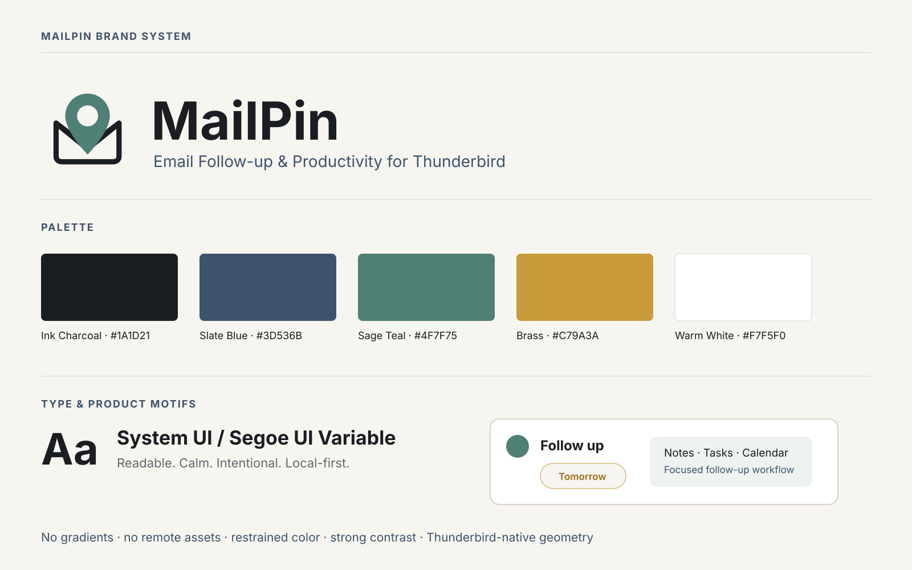

<div align="center">
  

# MailPin

**Email Follow-up & Productivity for Thunderbird**

[](https://github.com/ussmarines/mailpin-thunderbird/actions/workflows/ci.yml)


</div>

MailPin transforme les e-mails importants en suivi actionnable **sans remplacer la boîte de réception Thunderbird**. Épinglez un message, ajoutez une note ou une checklist, planifiez une relance, organisez vos vues et, lorsque l’agenda le permet, créez un événement ou une tâche — le tout localement.

## Pourquoi MailPin

- **Épingler sans altérer Thunderbird** — l’épinglage ne marque jamais un message lu/non lu et ne modifie pas les compteurs natifs.
- **Faire avancer le suivi** — états Actif, En attente, Planifié et Terminé, rappels, snooze et suivi de non-réponse.
- **Ajouter du contexte** — notes personnelles, sous-tâches, groupes, affaires, modèles et règles locales.
- **Retrouver vite** — recherche globale, vues enregistrées, Dashboard, Kanban et palette de commandes.
- **Relier l’Agenda** — événements et tâches uniquement lorsque le calendrier Thunderbird annonce la capacité correspondante.
- **Rester local-first** — aucune télémétrie, publicité, API distante, CDN ou code distant.

## Interface

**Organic Workspace** organise l’interface comme un véritable espace de travail : rail de navigation, canvas éditorial, contexte secondaire, panneaux plus organiques et micro-interactions fonctionnelles. La candidate 1.7.2 corrige la stabilité de navigation et plusieurs problèmes de géométrie/espacement observés en usage réel sans modifier les fonctions métier. Aucun dégradé, glow, glassmorphism, asset ou police distante. Les thèmes clair/sombre, le contraste forcé, le focus clavier et la réduction du mouvement restent pris en charge.

<div align="center">
  
</div>

## Compatibilité

- **Version source :** `1.7.2` — candidate de correction UI/navigation
- **Dernière release publique :** `1.7.1`
- **Thunderbird :** `153.0` à `153.*`
- **Format :** MailExtension Manifest V3
- **Langues :** français et anglais
- **ID public :** `ussmarines.mailpin@addons.thunderbird.net`

MailPin utilise une API Experiment privilégiée pour l’intégration `about:3pane`, le stockage SQLite local et certaines fonctions Messages/Tags/Agenda. Thunderbird peut donc afficher un avertissement d’accès complet à l’installation. Les frontières Messages, Tags et Agenda restent isolées derrière `PinCompatibility`.

## Installation

### Release GitHub

1. Téléchargez `MailPin_v1.7.1.xpi` depuis la release `v1.7.1`.
2. Thunderbird → **Extensions et thèmes** → engrenage → **Installer un module depuis un fichier**.
3. Sélectionnez le XPI.

> **Migration depuis 1.5.4 ou une build MailPerch :** la 1.6.0 adopte l’ID public définitif MailPin avant la première publication ATN. Exportez une sauvegarde depuis l’ancienne installation, puis désinstallez, installez MailPin et réimportez. Voir [la procédure d’identité](docs/IDENTITY_MIGRATION_REQUIRED.md).

### Depuis les sources

Prérequis : Python 3.11+ et Node.js 20+. Aucune dépendance npm/Python tierce n’est téléchargée.

```bash
npm run ci
```

Livrables reproductibles de la source candidate :

- `dist/MailPin_v1.7.2.xpi`
- `dist/MailPin_GitHub_Repository_v1.7.2.zip`
- `dist/SHA256SUMS.txt`

## Confidentialité & sécurité

MailPin ne contient aucun appel réseau runtime, aucune télémétrie, aucune publicité ni code distant. Le corps complet des messages et le contenu des pièces jointes ne sont pas copiés dans la base MailPin.

- [Politique de confidentialité](PRIVACY.md)
- [Politique de sécurité](SECURITY.md)
- [Audit sécurité source 1.7.2](SECURITY_AUDIT_1.7.2.md)
- [Rapport de validation source 1.7.2](VALIDATION_REPORT_1.7.2.md)
- [Limites connues](docs/KNOWN_LIMITATIONS.md)

## Documentation & support

- [Architecture](docs/ARCHITECTURE.md)
- [Compatibilité Thunderbird](docs/THUNDERBIRD_COMPATIBILITY.md)
- [Banc Thunderbird](docs/THUNDERBIRD_TEST_BENCH.md)
- [Build reviewers](release/BUILD_INSTRUCTIONS.md)
- [Préparation ATN](STORE_RELEASE.md)
- [Support et informations à fournir](SUPPORT.md)
- [Signaler un problème](https://github.com/ussmarines/mailpin-thunderbird/issues)

Maintenu par [ussmarines](https://github.com/ussmarines). Les dons [PayPal](https://paypal.me/ussmarinesdot) sont facultatifs et ne débloquent aucune fonction.

## Licence

MailPin est distribué sous la **MailPin Source-Available License 1.1**. Consultez [LICENSE](LICENSE).
