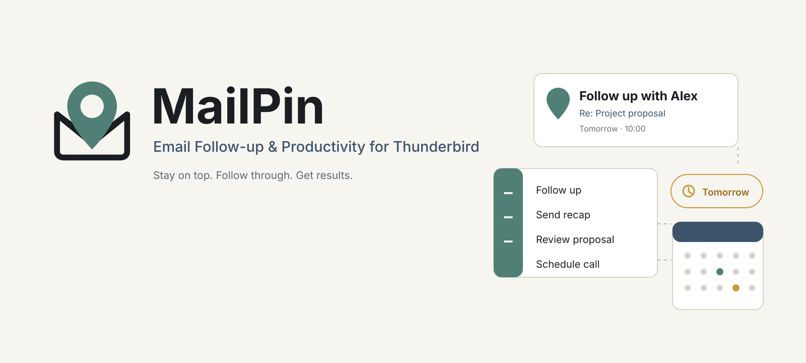

<div align="center">
  

# MailPin

**A local-first Thunderbird add-on for email follow-up, reminders, notes and task management.**

[](https://addons.thunderbird.net/en-US/thunderbird/addon/mailpin/)
[](https://github.com/ussmarines/mailpin-thunderbird/actions/workflows/ci.yml)
[](https://github.com/ussmarines/mailpin-thunderbird/releases/tag/v1.7.10)


**English** · [Français](README.fr.md)
</div>

MailPin is a privacy-focused **Thunderbird extension / add-on** that turns important email into actionable follow-up without replacing Thunderbird's native inbox. Pin messages, add notes and checklists, schedule reminders, snooze follow-ups, track unanswered email, and organize work with saved views, a dashboard and Kanban.

Everything runs locally: **no telemetry, no advertising, no remote API, no CDN and no remote code**.

## Install MailPin

The easiest installation path is the official **Add-ons for Thunderbird** listing:

**[Install MailPin from Add-ons for Thunderbird](https://addons.thunderbird.net/en-US/thunderbird/addon/mailpin/)**

You can also install the GitHub release `v1.7.10` manually:

1. Download `MailPin_v1.7.10.xpi` from the [GitHub release](https://github.com/ussmarines/mailpin-thunderbird/releases/tag/v1.7.10).
2. Open Thunderbird → **Add-ons and Themes**.
3. Open the gear menu → **Install Add-on From File**.
4. Select the XPI.

## What MailPin does

| Feature | What it gives you |
| --- | --- |
| **Email follow-up** | Pin important messages without changing read/unread state or Thunderbird's native counters. |
| **Reminders & snooze** | Bring email back at the right time instead of leaving it buried in the inbox. |
| **Reply tracking** | Track messages that still need a response and surface no-reply follow-ups. |
| **Notes & checklists** | Attach personal context, subtasks and next actions to email. |
| **Workflow states** | Move follow-ups through Active, Waiting, Planned and Completed states. |
| **Dashboard & Kanban** | Review email work outside the normal inbox flow. |
| **Saved views & search** | Find follow-ups quickly by state, context or custom views. |
| **Calendar integration** | Create supported Thunderbird Calendar items when the selected calendar exposes the required capability. |
| **Local-first privacy** | Keep MailPin data on your machine with no runtime network dependency. |

## Why MailPin

MailPin is aimed at people who use Thunderbird as a working inbox and need more than flags or stars:

- **email follow-up** without turning Thunderbird into a different mail client;
- **email reminders and snooze** for messages that matter later;
- **task-style workflows** for inbox follow-through;
- **notes, subtasks, templates, groups and cases** for context;
- **Kanban and saved views** for a clearer workload;
- **offline-first / local-first operation** with no telemetry or cloud account.

## Compatibility

- **Source version:** `1.7.10` — published
- **Latest public release:** `1.7.10`
- **Thunderbird:** `153.0` to `157.*`
- **Extension format:** MailExtension Manifest V3
- **Languages:** English and French
- **Public extension ID:** `ussmarines.mailpin@addons.thunderbird.net`
- **Repository:** https://github.com/ussmarines/mailpin-thunderbird

MailPin 1.7.10 uses a privileged Thunderbird Experiment for selected `about:3pane`, local SQLite, Messages, Tags and Calendar integration. The public release has been validated on Thunderbird 157.0.1; detailed evidence is kept in the validation and security reports rather than duplicated here.

## Privacy & security

MailPin makes **no runtime network calls** and contains no telemetry, advertising or remote code. Full message bodies and attachment contents are not copied into the MailPin database.

- [Privacy policy](PRIVACY.md)
- [Security policy](SECURITY.md)
- [Security audit — 1.7.10](SECURITY_AUDIT_1.7.10.md)
- [Validation report — 1.7.10](VALIDATION_REPORT_1.7.10.md)
- [Known limitations](docs/KNOWN_LIMITATIONS.md)

## Build from source

Requirements: Python 3.11+, Node.js 20+ and npm 10+.

```bash
npm run ci
```

Published-source build outputs:

- `dist/MailPin_v1.7.10.xpi`
- `dist/MailPin_GitHub_Repository_v1.7.10.zip`
- `dist/SHA256SUMS.txt`

## Documentation

- [Architecture](docs/ARCHITECTURE.md)
- [Thunderbird compatibility](docs/THUNDERBIRD_COMPATIBILITY.md)
- [Thunderbird test bench](docs/THUNDERBIRD_TEST_BENCH.md)
- [Reviewer build instructions](release/BUILD_INSTRUCTIONS.md)
- [Add-ons for Thunderbird release preparation](STORE_RELEASE.md)
- [Support](SUPPORT.md)
- [Contributing](CONTRIBUTING.md)

## Support the project

MailPin is maintained by [ussmarines](https://github.com/ussmarines). Contributions and issue reports are welcome. Optional [PayPal donations](https://paypal.me/ussmarinesdot) support development and unlock no functionality.

## License

MailPin is distributed under the **MailPin Source-Available License 1.1**. See [LICENSE](LICENSE).
